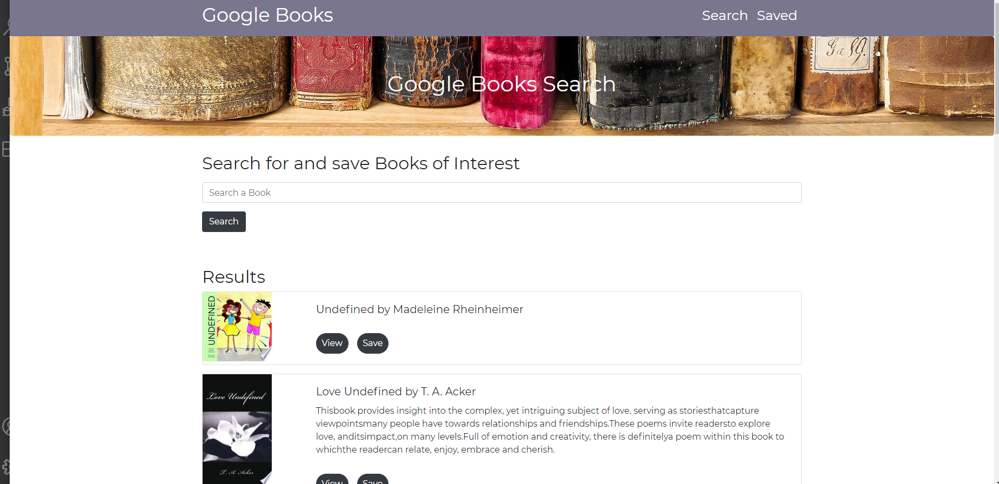
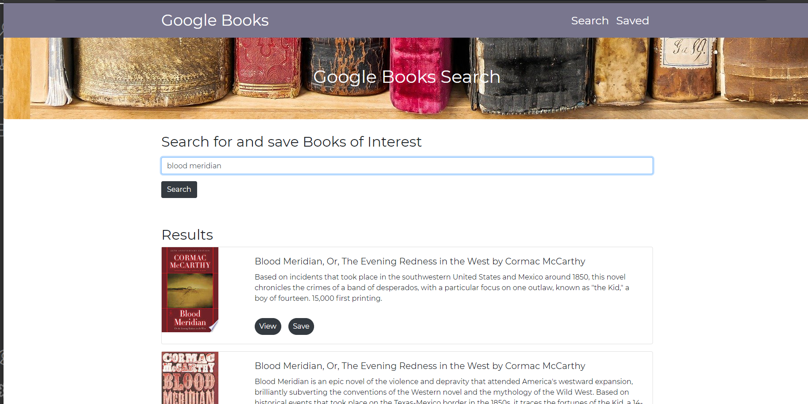
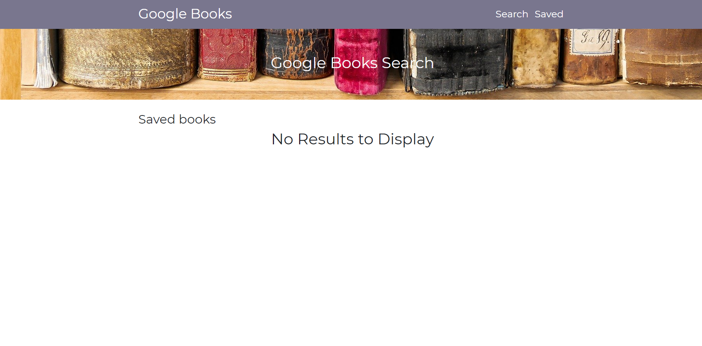

# Book Search

## Live Links

https://github.com/haydenabeck/BookSearch

## Contributors

@haydenabeck
My tutor Sammantha
My TA's

## Description

Google Books Search app that displays books based on user searches. Users can save books to review or purchase later.

## Technology Stack

React, CSS, Axios, Express, and Mongoose

## Usage

This site acts as a quick and easy book catalouge. Search for books and save'em

## Screenshots

- Homepage
  

- Search
  

- Save
  

## Contact

#### Name (@haydenabeck)

- Email: [haydenabeck@gmail.com](haydenabeck@gmail.com)
- LinkedIn: https://www.linkedin.com/in/hayden-beck-17109419a/
